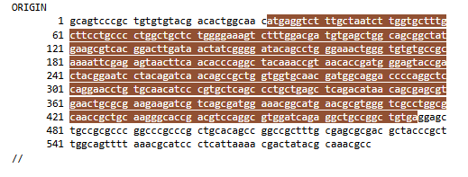
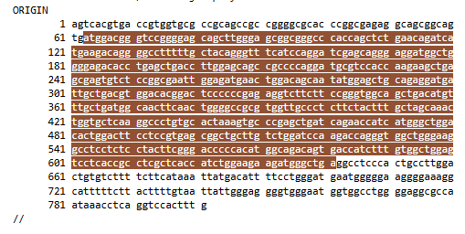
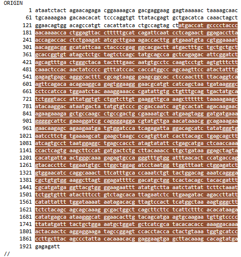
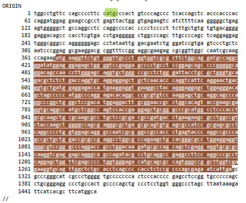

## R para primers

El diseño de primers con herramientas computacionales no es novedad,
incluso hay paquetes en R que pueden ayudarte a esta tarea como
openPrimeR de Bioconductor. Este proyecto hace uso del programa
Biostrings, ciclos, funciones y condiciones para encontrar primers en
secuencias de no más de 20,000 nucleótidos, sólo de DNA, sólo para
eucariotas.

Este programa permite el diseño de primers *forward* (Fw) y *reverse*
(rv)

## Pre-evaluación de la secuencia

Función `pre_fw` realiza un asesoramiento inicial de la secuencia
codificante mediante el uso de la instrucción `if()` para verificar los
siguientes requerimientos:

-   La clase del objeto que contiene la secuencia, debe ser
    DNAStringSet.
-   No es degenerado
-   Longitud de la secuencia \< 20,000 nucleótidos
-   Contiene el codón de inicio ATG (para metionina)

## Creación de la función para evaluar la secuencia

```{r pre_fw, echo=TRUE}

library(Biostrings)

secun_prueba1 <- readDNAStringSet("Uso_del_proyecto_files/gallus.fasta") # 1. Cargar secuencia

pre_fw <- function(secun_prueba) {
  tipo_sec <- class(secun_prueba)
  tipo_sec[1]
  
  # Para evaluar tipo de secuencia
  if (tipo_sec[1] == "DNAStringSet") {
   
     # Comprobar que no es degenerado
    no_degenerado <- alphabetFrequency(secun_prueba, baseOnly=TRUE)
    if (no_degenerado[5] == 0) {
      
      # Verificar el largo de la secuencia
      longt <- width(secun_prueba)
      if ( longt < 20000) {
        
        # Codon de inicio: TAC -> ATG
        codon_in <- vmatchPattern ("ATG", secun_prueba)
        codon_in[[1]][1]
        print(codon_in)
      } else { 
        print("La capacidad maxima es de 20,000 nucleotidos")}}
  } else { 
      print("Cambiar a DNA")
    }
  }

pre_fw(secun_prueba1) 
# El codon de inicio: si está muy cerca, porque está más de una vez, intenete con otras posiciones

```

#### Función \*fw_primer\*\*

`fw_primer` evalúa primers *forward* potenciales tomando en cuenta 3
parámetros:

-   Posición del codón de inicio
-   Secuencia a evaluar
-   Longitud de la secuencia a evaluar

```{r primer_fw, include=TRUE}
primer_fw <-function (inicio_codon, secun_prueba, ultima) {
  detener <- inicio_codon - ultima
  inicio <- 0
  while (inicio <= detener & ultima < inicio_codon ) {
          inicio <- inicio + 1  
          primer_fd <- subseq (secun_prueba, start=inicio, end=ultima) 
          ultima <- ultima + 1
          
          final<-complement(primer_fd)
          ##### Eveluar condiciones de primer
          # Patrones

          tripletes <- trinucleotideFrequency(final)
          patrones_malos <- tripletes[c(22, 43, 44, 16, 41, 49, 61)]
          no_hay <- c(0,0,0,0,0,0,0)
          comparacion <- all(patrones_malos == no_hay)
          
          if (comparacion == TRUE) { #Seguir evaluando el primer 

            # Poct de CG: 50-60 %
            longt <- width(final)
            cont_cg <- letterFrequency(final, "CG")
            porc_cg <- (cont_cg / longt) * 100
            
            if (porc_cg < 61 & porc_cg > 49) {#Seguir evaluando
              #Temperatura: 55 - 65 °C
              cont_cg <- letterFrequency(final, "CG")
              cont_at <- letterFrequency(final, "AT")
              temperatura <- (4*cont_cg) + (2*cont_at)
              
              if (temperatura >54 & temperatura <66 ) {
                
                print("Forward")
                print(final)
                print(paste("Porcentaje de CG: ", porc_cg))
                print(paste("Tm: ", temperatura,"°C"))

              }
              }
          }
          } 
  } 
```

Un ciclo `while` hace una iteración tantas veces desde el codón de
inicio hasta la última base de la secuencia, siempre y cuando la
posición de la base en donde se inicia se encuentre sea correspondiente
a un número dentro de la longitud de la secuencia.

El resultado es el primer, la secuencia complementaria, que es evaluado
mediante instrucciones `if()` a fin de que cumpla los diferentes
criterios:

***Evaluación***

-   Longitud de 20 pb
-   Presencia de secuencias que favorecen la formación de horquillas:
    -   Tripletes GGG, CCC, GGT, ATT, CGA, TAA o TTA
-   Porcentaje de GC entre 50%-60%
-   Temperatura de fusión entre 55-65°C, se calcula como TM = 4GC + 2 AT

***Ejemplo de aplicacón de la función***

```{r variables, include=TRUE}
primer_fw (32, secun_prueba1, 18) # Colocar el valor del start , secuencia, long del primer.
```

Implementación completa en: [evaluar.R](scrips/evaluar.R).

##### Primers *Reverse*


Los primers *reverse* se diseñan a partir de la secuencia reversa
complementaria. 1. Identificación de los codones de paro (TGA, TAG y
TAA) \##### Como la secuencia fue revertida inicialmente, se busca
complemento reverso de estos codones (AGT, GAT, AAT) 2. Generación de la
secuencia complementaria al ...

Verificación de los mismos criterios \* Longitud de 20 pb + Presencia de
secuencias que favorecen la formación de horquillas: + Tripletes GGG,
CCC, GGT, ATT, CGA, TAA o TTA \* Porcentaje de GC entre 50%-60% +
Temperatura de fusión entre 55-65°C (TM = 4GC + 2 AT)

#### TGA - **primer_rev_ct1**

TGA primer_rev_ct1

```{r echo=TRUE, message=FALSE, warning=FALSE}
#####Primer con TGA

revertida <-reverse(secun_prueba1)
revertida

vmatchPattern ("AGT",revertida) -> tga 
tga

primer_rev_ct1<-function(tga1,secrev,ultima) {
  tga_rv_primers <- list ()
  detener <- tga1 - ultima

  inicio <- 0
  while (inicio <= detener & ultima < tga1 ) {
    inicio <- inicio + 1  
    primer_rv<- subseq(revertida, start=inicio, end=ultima) 
    ultima <- ultima + 1
    final<-complement(primer_rv) #la secuencia complentaria
    
    tripletes <- trinucleotideFrequency(final)#patrones que favorecen horquillas,
    #dímeros..
    patrones_malos <- tripletes[c(22, 43, 44, 16, 41, 49, 61)]
    no_hay <- c(0,0,0,0,0,0,0)
    comparacion <- all(patrones_malos == no_hay)

    if (comparacion == TRUE) { 
      longt <- width(primer_rv)#revisar %gc
      cont_cg <- letterFrequency(primer_rv, "CG")
      porc_cg <- (cont_cg / longt) * 100
      
      if (porc_cg < 61 & porc_cg > 49){ 
        cont_cg <- letterFrequency(primer_rv, "CG")
        cont_at <- letterFrequency(primer_rv, "AT")
        temperatura <- (4*cont_cg) + (2*cont_at) ##Tm 
        
        if (temperatura >54 & temperatura <66 ) {
          tga_rv_primers <- append (tga_rv_primers, list (list (primer = primer_rv, porc_cg = porc_cg, temperatura = temperatura)))
        }
      }
    }
  }
  if (length(tga_rv_primers) > 0) {
    for (primer in tga_rv_primers) {
      print("reverse tga")
      print(primer$primer)
      print(paste("Porcentaje de CG: ", primer$porc_cg))
      print(paste("Tm: ", primer$temperatura, "°C"))
    }
  } else { 
    tga_rv_primers <- NULL
  }
  return (tga_rv_primers)
}  

primer_rev_ct1(114,revertida, 20) # Primers con TGA, puedes, jugar con los valores de 
# Start del objeto TGA, considerando tu región codificante (CDS)

```


#### TAG - **primer_rev_ct2**

TAG primer_rev_ct2

```{r echo=TRUE, message=FALSE, warning=FALSE}
#####Primer con TAG

vmatchPattern ("GAT",revertida)->tag
tag


primer_rev_ct2<-function(tag1,secrev,ultima) {
  tag_rv_primers <- list ()
  detener <- tag1 - ultima
  inicio <- 0
  while (inicio <= detener & ultima < tag1 ) {
    inicio <- inicio + 1  
    primer_rv<- subseq(revertida, start=inicio, end=ultima) 
    ultima <- ultima + 1
    final<-complement(primer_rv)##secuencia complementaria
    
    tripletes <- trinucleotideFrequency(primer_rv)#revisar patrones indeseados
    patrones_malos <- tripletes [c(22, 43, 44, 16, 41, 49, 61)]
    no_hay <- c(0,0,0,0,0,0,0)
    comparacion <- all(patrones_malos == no_hay)
    
    if (comparacion == TRUE) { 
      
      longt <- width(primer_rv)#%gc
      cont_cg <- letterFrequency(primer_rv, "CG")
      porc_cg <- (cont_cg / longt) * 100
      
      if (porc_cg < 61 & porc_cg > 49) {##%gc
        cont_cg <- letterFrequency(primer_rv, "CG")
        cont_at <- letterFrequency(primer_rv, "AT")
        temperatura <- (4*cont_cg) + (2*cont_at) ##Tm 
        
        if (temperatura >54 & temperatura <66 ) {
          tag_rv_primers <- append (tag_rv_primers, list(list (primer = primer_rv, porc_cg = porc_cg, temperatura = temperatura)))
        }
      }
    }
  }
  if (length(tag_rv_primers) > 0) {
    for (primer in tag_rv_primers) {
      print("reverse tag")
      print(primer$primer)
      print(paste("Porcentaje de CG: ", primer$porc_cg))
      print(paste("Tm: ", primer$temperatura, "°C"))
    }
  } else { 
    tag_rv_primers <- NULL
  }
  return (tag_rv_primers)
} 


primer_rev_ct2(222,revertida, 20)#reverse TAG,sujeto a que tenga este patrón,puedes
#jugar con los valores de start del objeto tga, considerando tu región codificante (CDS)

```

#### TAA - **primer_rev_ct3**

TAA primer_rev_ct3

```{r echo=TRUE, message=FALSE, warning=FALSE}
######Primers con TAA
vmatchPattern("AAT",revertida)->taa
taa

primer_rev_ct3<-function(taa1,secrev,ultima) {
  taa_rv_primers <- list ()
  detener <- taa1 - ultima
  inicio <- 0
  while (inicio <= detener & ultima < taa1 ) {
    inicio <- inicio + 1  
    primer_rv<- subseq(revertida, start=inicio, end=ultima) 
    ultima <- ultima + 1
    tripletes <- trinucleotideFrequency(primer_rv)#revisar patrones indeseados
    patrones_malos <- tripletes[c(22, 43, 44, 16, 41, 49, 61)]
    no_hay <- c(0,0,0,0,0,0,0)
    comparacion <- all(patrones_malos == no_hay)
    
    if (comparacion == TRUE) { #Seguir evaluando el primer 
      # Poct de CG
      longt <- width(primer_rv)
      cont_cg <- letterFrequency(primer_rv, "CG")
      porc_cg <- (cont_cg / longt) * 100
      
      if (porc_cg < 61 & porc_cg > 49) {##%gc
        cont_cg <- letterFrequency(primer_rv, "CG")
        cont_at <- letterFrequency(primer_rv, "AT")
        temperatura <- (4*cont_cg) + (2*cont_at) ##Tm 
        
        if (temperatura >54 & temperatura <66 ) {
          taa_rv_primers <- append (taa_rv_primers, list(list (primer = primer_rv, porc_cg = porc_cg, temperatura = temperatura)))
        }
      }
    }
  } 
  if (length(taa_rv_primers) > 0) {
    for (primer in taa_rv_primers) {
      print("reverse taa")
      print(primer$primer)
      print(paste("Porcentaje de CG: ", primer$porc_cg))
      print(paste("Tm: ", primer$temperatura, "°C"))
    }
  } else { 
    taa_rv_primers <- NULL
  }
  return (taa_rv_primers)
}

primer_rev_ct3(37,revertida, 20) #reverse TAG,sujeto a que tenga este patrón,puedes
#jugar con los valores de start del objeto tga, considerando tu región codificante (CDS)
```

## Archivo FASTA

-   Requiere que los primers sean guardados en una lista
-   Uso de 2 funciones:
    1.  Adición de secuencias de primer a una lista
    2.  Conversión de la lista de primers válidos a FASTA
-   Uso del paquete seqinr para uso de `write.fasta`

------------------------------------------------------------------------

------------------------------------------------------------------------

```{r objetos_funciones, echo=TRUE, message=FALSE, warning=FALSE}
#Objetos con las funciones
primer_fw (32, secun_prueba1,18) -> fw_primers

primer_rev_ct1 (114, revertida,20) -> tga_primers

primer_rev_ct2 (222, revertida,20) -> tag_primers

primer_rev_ct3 (37, revertida,20) -> taa_primers
```

#### 1) Función `primers_validos`

Adición de primers válidos, que no den como resultado una `list ()` o un
`NULL`

```{r primers_validos, echo=TRUE, message=FALSE, warning=FALSE}
primers_validos <- function (fw_primers, tga_primers, tag_primers, taa_primers) {
  lista_primers <- list()
  #forward 
  if (!is.null(fw_primers)) {
    for (primer in fw_primers) {
      lista_primers <- c(lista_primers, list(list(nombre = "Forward primer", secuencias = primer$primer)))
    }
  }
  #TGA reverso
  if (!is.null(tga_primers)) {
    for (primer in tga_primers) {
      lista_primers <- c(lista_primers, list(list(nombre = "TGA - Reverse primer", secuencias = primer$primer)))
    }
  }
  #TAG reverso
  if (!is.null(tag_primers)) {
    for (primer in tag_primers) {
      lista_primers <- c(lista_primers, list(list(nombre = "TAG - Reverse primer", secuencias = primer$primer)))
    }
  }
  #TAA reverso
  if (!is.null(taa_primers)) {
    for (primer in taa_primers) {
      lista_primers <- c(lista_primers, list(list(nombre = "TAA - Reverse primer", secuencias = primer$primer)))
    }
  }
  return(lista_primers)
}

#Guardar en un objeto 
lista_primers <- primers_validos (fw_primers, tga_primers, tag_primers, taa_primers)

```

#### 2) Función `escribir.fasta`

Escribir la lista a un archivo FASTA

```{r escribir_fasta, message=FALSE, warning=FALSE}

escribir_fasta <- function (lista_primers) {
  lista_secuencias <- list ()
  lista_nombres <- list ()   
  
  for (primer in lista_primers) {
    secuencias <- as.character (primer$secuencias) #sino se imprime todo el DNAStringSet en el fasta
    lista_secuencias <- c(lista_secuencias, secuencias)
    lista_nombres <- c(lista_nombres, primer$nombre)
  }
  
  if (length(lista_secuencias) > 0  & length(lista_nombres) > 0) {
    library(seqinr)
    write.fasta (sequences = lista_secuencias, 
                names = lista_nombres, 
                nbchar = 80, 
                file.out = "Uso_del_proyecto_files/primer_gallus.fasta")
    print("Ver primers en carpeta de resultados")
  }
}

escribir_fasta (lista_primers)

```

####Puntos a considerar al usar esta secuencia/limitaciones con ejemplos

##Ideal

Secuencia en la que el codón de inicio aparece una sola vez y los codones de paro 
no se extienden hasta la región codificante


##Regiones no codificantes del gen cortas.

Cunado hay regiones no codificantes cortas en uno o ambos extremos, es muy
probable que no salga alguno de los primers. El usuario debe decidir cuanto está 
dispuesto a ceder para obtenerlos.


```{r l1}
# Lectura de la secuencia
secun_prueba1 <- readDNAStringSet("Uso_del_proyecto_files/musmusculusBAX.fasta")
secun_prueba1
############################
####################     PRIMERS FORWARD      ############################
############################

#   IDENTIFICACION DE LA SEC CODIF (CDS)

pre_fw <- function(secun_prueba) {
  tipo_sec <- class(secun_prueba)
  tipo_sec[1]
  
  # Para evaluar tipo de secuencia
  if (tipo_sec[1] == "DNAStringSet") {
    # Comprobar que no es degenerado
    no_degenerado <- alphabetFrequency(secun_prueba, baseOnly=TRUE)
    
    if (no_degenerado[5] == 0) {
      # Verificar el largo de la secuencia
      longt <- width(secun_prueba)
      if ( longt < 20000) {
        # Codon de inicio: TAC -> ATG
        codon_in <- vmatchPattern("ATG", secun_prueba)
        codon_in[[1]][1]
      } else { print("La capacidad maxima es de 20,000 nucleotidos")}}} else { print("Cambiar a DNA")}
}

pre_fw(secun_prueba1) # Prueba

####################

#  GENERADOR DE PRIMERS FORWARD

primer_fw <-function(inicio_codon, secun_prueba, ultima) {
  detener <- inicio_codon - ultima
  inicio <- 0
  while (inicio <= detener & ultima < inicio_codon ) {
    inicio <- inicio + 1  
    primer_fd <- subseq(secun_prueba, start=inicio, end=ultima) 
    ultima <- ultima + 1
    
    final<-complement(primer_fd)
    ##### Eveluar condiciones de primer
    # Patrones
    tripletes <- trinucleotideFrequency(final)
    patrones_malos <- tripletes[c(22, 43, 44, 16, 41, 49, 61)]
    no_hay <- c(0,0,0,0,0,0,0)
    comparacion <- all(patrones_malos == no_hay)
    tolerancia<-sum(patrones_malos!=0)
    if (comparacion == TRUE |tolerancia==1) { #Seguir evaluando el primer 
      # Poct de CG: 50-60 %
      longt <- width(final)
      cont_cg <- letterFrequency(final, "CG")
      porc_cg <- (cont_cg / longt) * 100
      
      if (porc_cg < 61 & porc_cg > 49) {#Seguir evaluando
        #Temperatura: 55 - 65 °C
        cont_cg <- letterFrequency(final, "CG")
        cont_at <- letterFrequency(final, "AT")
        temperatura <- (4*cont_cg) + (2*cont_at)
        
        if (temperatura >54 & temperatura <66 ) {
          
          print("Forward")
          print(final)
          print(paste("Porcentaje de CG: ", porc_cg))
          print(paste("Tm: ", temperatura))
          
        }
      }
    }
  } 
} 


primer_fw(63, secun_prueba1, 21) # Colocar el valor del start , secuencia, long del primer. 
#Hasta 150 encuentra 2, pero se pasa por más de la mitad del límite
```
```{r l1_r, echo=FALSE}
# Primer con TGA
revertida <-reverse(secun_prueba1)
revertida

vmatchPattern("AGT",revertida)->tga
tga

primer_rev_ct1<-function(tga1,secrev,ultima) {
  detener <- tga1 - ultima
  inicio <- 0
  while (inicio <= detener & ultima < tga1 ) {
    inicio <- inicio + 1  
    primer_rv<- subseq(revertida, start=inicio, end=ultima) 
    ultima <- ultima + 1
    final<-complement(primer_rv)#la secuencia complentaria
    
    tripletes <- trinucleotideFrequency(final)#patrones que favorecen horquillas,
    #dímeros..
    patrones_malos <- tripletes[c(22, 43, 44, 16, 41, 49, 61)]
    no_hay <- c(0,0,0,0,0,0,0)
    comparacion <- all(patrones_malos == no_hay)
    
    if (comparacion == TRUE) { 
      longt <- width(primer_rv)#revisar %gc
      cont_cg <- letterFrequency(primer_rv, "CG")
      porc_cg <- (cont_cg / longt) * 100
      
      if (porc_cg < 61 & porc_cg > 49){ 
        cont_cg <- letterFrequency(primer_rv, "CG")
        cont_at <- letterFrequency(primer_rv, "AT")
        temperatura <- (4*cont_cg) + (2*cont_at) ##Tm 
        
        if (temperatura >54 & temperatura <66 ) {
          print("reverse tga")
          print(primer_rv)
          print(paste("Porcentaje de CG: ", porc_cg))
          print(paste("Tm: ", temperatura))
        }
      }
    }
  }
} 

primer_rev_ct1(100,revertida, 20) # Primers con TGA, puedes, jugar con los valores de 
# Start del objeto TGA, considerando tu región codificante (CDS)

####################
# Primer con TAG

vmatchPattern("GAT",revertida)->tag
tag

primer_rev_ct2<-function(tag1,secrev,ultima) {
  detener <- tag1 - ultima
  inicio <- 0
  while (inicio <= detener & ultima < tag1 ) {
    inicio <- inicio + 1  
    primer_rv<- subseq(revertida, start=inicio, end=ultima) 
    ultima <- ultima + 1
    final<-complement(primer_rv)##secuencia complementaria
    
    tripletes <- trinucleotideFrequency(primer_rv)#revisar patrones indeseados
    patrones_malos <- tripletes[c(22, 43, 44, 16, 41, 49, 61)]
    no_hay <- c(0,0,0,0,0,0,0)
    comparacion <- all(patrones_malos == no_hay)
    
    if (comparacion == TRUE) { 
      
      longt <- width(primer_rv)#%gc
      cont_cg <- letterFrequency(primer_rv, "CG")
      porc_cg <- (cont_cg / longt) * 100
      
      if (porc_cg < 61 & porc_cg > 49) {##%gc
        cont_cg <- letterFrequency(primer_rv, "CG")
        cont_at <- letterFrequency(primer_rv, "AT")
        temperatura <- (4*cont_cg) + (2*cont_at) ##Tm 
        
        if (temperatura >54 & temperatura <66 ) {
          print("reverse tag")
          print(primer_rv)
          print(paste("Porcentaje de CG: ", porc_cg))
          print(paste("Tm: ", temperatura))
        }
      }
    }
  } 
} 

primer_rev_ct2(387,revertida, 20)#reverse TAG,sujeto a que tenga este patrón,puedes
#jugar con los valores de start del objeto tga, considerando tu región codificante (CDS)


####################
# Primers con TAA
vmatchPattern("AAT",revertida)->taa
taa

primer_rev_ct3<-function(taa1,secrev,ultima) {
  detener <- taa1 - ultima
  inicio <- 0
  while (inicio <= detener & ultima < taa1 ) {
    inicio <- inicio + 1  
    primer_rv<- subseq(revertida, start=inicio, end=ultima) 
    ultima <- ultima + 1
    tripletes <- trinucleotideFrequency(primer_rv)#revisar patrones indeseados
    patrones_malos <- tripletes[c(22, 43, 44, 16, 41, 49, 61)]
    no_hay <- c(0,0,0,0,0,0,0)
    comparacion <- all(patrones_malos == no_hay)
    
    if (comparacion == TRUE) { #Seguir evaluando el primer 
      # Poct de CG
      longt <- width(primer_rv)
      cont_cg <- letterFrequency(primer_rv, "CG")
      porc_cg <- (cont_cg / longt) * 100
      
      if (porc_cg < 61 & porc_cg > 49) {##%gc
        cont_cg <- letterFrequency(primer_rv, "CG")
        cont_at <- letterFrequency(primer_rv, "AT")
        temperatura <- (4*cont_cg) + (2*cont_at) ##Tm 
        
        if (temperatura >54 & temperatura <66 ) {
          print("reverse taa")
          print(primer_rv)
          print(paste("Porcentaje de CG: ", porc_cg))
          print(paste("Tm: ", temperatura))
        }
      }
    }
  } 
}

primer_rev_ct3(18,revertida, 18)
```

##Cuando es muy corto el lado no codificante es muy corto



```{r echo=FALSE, message=TRUE, warning=FALSE}
secun_prueba1 <- readDNAStringSet("Uso_del_proyecto_files/frogESR.fasta")
secun_prueba1

# Primer con TGA
revertida <-reverse(secun_prueba1)
revertida

vmatchPattern("AGT",revertida)->tga
tga

primer_rev_ct1<-function(tga1,secrev,ultima) {
  detener <- tga1 - ultima
  inicio <- 0
  while (inicio <= detener & ultima < tga1 ) {
    inicio <- inicio + 1  
    primer_rv<- subseq(revertida, start=inicio, end=ultima) 
    ultima <- ultima + 1
    final<-complement(primer_rv)#la secuencia complentaria
    
    tripletes <- trinucleotideFrequency(final)#patrones que favorecen horquillas,
    #dímeros..
    patrones_malos <- tripletes[c(22, 43, 44, 16, 41, 49, 61)]
    no_hay <- c(0,0,0,0,0,0,0)
    comparacion <- all(patrones_malos == no_hay)
    
    if (comparacion == TRUE) { 
      longt <- width(primer_rv)#revisar %gc
      cont_cg <- letterFrequency(primer_rv, "CG")
      porc_cg <- (cont_cg / longt) * 100
      
      if (porc_cg < 61 & porc_cg > 49){ 
        cont_cg <- letterFrequency(primer_rv, "CG")
        cont_at <- letterFrequency(primer_rv, "AT")
        temperatura <- (4*cont_cg) + (2*cont_at) ##Tm 
        
        if (temperatura >54 & temperatura <66 ) {
          print("reverse tga")
          print(primer_rv)
          print(paste("Porcentaje de CG: ", porc_cg))
          print(paste("Tm: ", temperatura))
        }
      }
    }
  }
} 

primer_rev_ct1(29,revertida, 20) # Primers con TGA, puedes, jugar con los valores de 
# Start del objeto TGA, considerando tu región codificante (CDS)

####################
# Primer con TAG

vmatchPattern("GAT",revertida)->tag
tag

primer_rev_ct2<-function(tag1,secrev,ultima) {
  detener <- tag1 - ultima
  inicio <- 0
  while (inicio <= detener & ultima < tag1 ) {
    inicio <- inicio + 1  
    primer_rv<- subseq(revertida, start=inicio, end=ultima) 
    ultima <- ultima + 1
    final<-complement(primer_rv)##secuencia complementaria
    
    tripletes <- trinucleotideFrequency(primer_rv)#revisar patrones indeseados
    patrones_malos <- tripletes[c(22, 43, 44, 16, 41, 49, 61)]
    no_hay <- c(0,0,0,0,0,0,0)
    comparacion <- all(patrones_malos == no_hay)
    
    if (comparacion == TRUE) { 
      
      longt <- width(primer_rv)#%gc
      cont_cg <- letterFrequency(primer_rv, "CG")
      porc_cg <- (cont_cg / longt) * 100
      
      if (porc_cg < 61 & porc_cg > 49) {##%gc
        cont_cg <- letterFrequency(primer_rv, "CG")
        cont_at <- letterFrequency(primer_rv, "AT")
        temperatura <- (4*cont_cg) + (2*cont_at) ##Tm 
        
        if (temperatura >54 & temperatura <66 ) {
          print("reverse tag")
          print(primer_rv)
          print(paste("Porcentaje de CG: ", porc_cg))
          print(paste("Tm: ", temperatura))
        }
      }
    }
  } 
} 

primer_rev_ct2(106,revertida, 20)#reverse TAG,sujeto a que tenga este patrón,puedes
#jugar con los valores de start del objeto tga, considerando tu región codificante (CDS)


####################
# Primers con TAA
vmatchPattern("AAT",revertida)->taa
taa

primer_rev_ct3<-function(taa1,secrev,ultima) {
  detener <- taa1 - ultima
  inicio <- 0
  while (inicio <= detener & ultima < taa1 ) {
    inicio <- inicio + 1  
    primer_rv<- subseq(revertida, start=inicio, end=ultima) 
    ultima <- ultima + 1
    tripletes <- trinucleotideFrequency(primer_rv)#revisar patrones indeseados
    patrones_malos <- tripletes[c(22, 43, 44, 16, 41, 49, 61)]
    no_hay <- c(0,0,0,0,0,0,0)
    comparacion <- all(patrones_malos == no_hay)
    
    if (comparacion == TRUE) { #Seguir evaluando el primer 
      # Poct de CG
      longt <- width(primer_rv)
      cont_cg <- letterFrequency(primer_rv, "CG")
      porc_cg <- (cont_cg / longt) * 100
      
      if (porc_cg < 61 & porc_cg > 49) {##%gc
        cont_cg <- letterFrequency(primer_rv, "CG")
        cont_at <- letterFrequency(primer_rv, "AT")
        temperatura <- (4*cont_cg) + (2*cont_at) ##Tm 
        
        if (temperatura >54 & temperatura <66 ) {
          print("reverse taa")
          print(primer_rv)
          print(paste("Porcentaje de CG: ", porc_cg))
          print(paste("Tm: ", temperatura))
        }
      }
    }
  } 
}

primer_rev_ct3(100,revertida, 24)
```

##Cuanto encuentra un condón de inicio o paro de manera precipitada



```{r echo=TRUE, message=FALSE, warning=FALSE}
secun_prueba1 <- readDNAStringSet("Uso_del_proyecto_files/cabraaopae.fasta")
secun_prueba1
#   IDENTIFICACION DE LA SEC CODIF (CDS)

pre_fw <- function(secun_prueba) {
  tipo_sec <- class(secun_prueba)
  tipo_sec[1]
  
  # Para evaluar tipo de secuencia
  if (tipo_sec[1] == "DNAStringSet") {
    # Comprobar que no es degenerado
    no_degenerado <- alphabetFrequency(secun_prueba, baseOnly=TRUE)
    
    if (no_degenerado[5] == 0) {
      # Verificar el largo de la secuencia
      longt <- width(secun_prueba)
      if ( longt < 20000) {
        # Codon de inicio: TAC -> ATG
        codon_in <- vmatchPattern("ATG", secun_prueba)
        codon_in[[1]][1]
        print(codon_in)
      } else { print("La capacidad maxima es de 20,000 nucleotidos")}}} else { print("Cambiar a DNA")}
}

pre_fw(secun_prueba1) #Identifica un atg bastante lejos del inicio de la región codificante

####################

#  GENERADOR DE PRIMERS FORWARD

primer_fw <-function(inicio_codon, secun_prueba, ultima) {
  detener <- inicio_codon - ultima
  inicio <- 0
  while (inicio <= detener & ultima < inicio_codon ) {
    inicio <- inicio + 1  
    primer_fd <- subseq(secun_prueba, start=inicio, end=ultima) 
    ultima <- ultima + 1
    
    final<-complement(primer_fd)
    ##### Eveluar condiciones de primer
    # Patrones
    tripletes <- trinucleotideFrequency(final)
    patrones_malos <- tripletes[c(22, 43, 44, 16, 41, 49, 61)]
    no_hay <- c(0,0,0,0,0,0,0)
    comparacion <- all(patrones_malos == no_hay)
    tolerancia<-sum(patrones_malos!=0)
    if (comparacion == TRUE |tolerancia==1) { #Seguir evaluando el primer 
      # Poct de CG: 50-60 %
      longt <- width(final)
      cont_cg <- letterFrequency(final, "CG")
      porc_cg <- (cont_cg / longt) * 100
      
      if (porc_cg < 61 & porc_cg > 49) {#Seguir evaluando
        #Temperatura: 55 - 65 °C
        cont_cg <- letterFrequency(final, "CG")
        cont_at <- letterFrequency(final, "AT")
        temperatura <- (4*cont_cg) + (2*cont_at)
        
        if (temperatura >54 & temperatura <66 ) {
          
          print("Forward")
          print(final)
          print(paste("Porcentaje de CG: ", porc_cg))
          print(paste("Tm: ", temperatura))
          
        }
      }
    }
  } 
} 


primer_fw(100, secun_prueba1,19) # Colocar el valor del start , secuencia, long del primer. 
#Hasta 150 encuentra 2, pero se pasa por más de la mitad del límite

```

